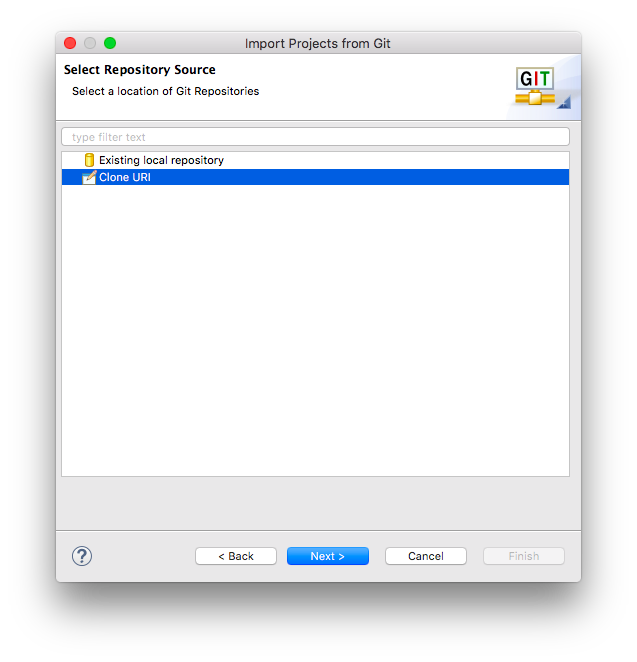

AP Java Review
===
Presentation: https://goo.gl/9pfG6q

This repository is a collection of resources for use with the free response practice in the accompanying presentation.

Clone in Eclipse
---
This repository is designed to be cloned in Eclipse. Here is the procedure to clone this project in eclipse:
1. In the menus, click 'File' -> 'Import'

2. Under the 'Git' folder select 'Projects from Git' then 'Next >' 

3. On the next screen click 'Clone URL' then 'Next >'

4. On the next screen under 'Location' there should be a 'URL' field. Copy and paste the url for this 
repository (https://github.com/ephs/ap-java-review.git) into the field and click 'Next >'

5. On the 'Branch Selection' screen assure the branch 'master' is checked, then click 'Next >'

6. On the 'Local Destination' screen you may adjust where you want the repository if you wish, then click 'Next >'

7. Select 'Import existing Eclipse project' as the wizard for the project import, then click 'Next >'

8. Then 'Finish' as the process is complete. You should now have a new project named 'ap-java-review'

Contributors
---
* eduxstad
* Jythonscript